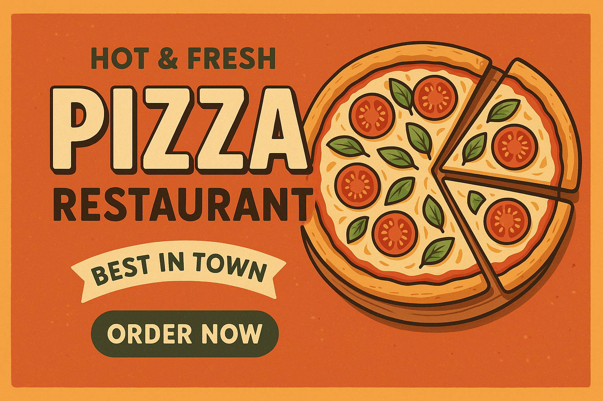

<h1 align="center">🍕 PIZZA RESTAURANT</h1>

  

  Welcome to <strong>Pizza Restaurant</strong> — the ultimate digital hub for every pizza lover!  
  Here, we combine passion, flavor, and technology to bring you the most delicious experience online.  
  Whether you’re craving a classic Margherita, an indulgent 4 Fromages, or want to invent your own creation,  
  our platform makes it all possible.  

  🅠Discover the ingredients, origins, and stories behind each pizza. 
  🧀 Explore nearby restaurants serving your favorites. 
  🕠Add your own recipes, photos, and ideas to inspire the community. 
  🔠Use our smart search to instantly find the pizza that fits your mood. 
  ❤️ Save and share your personal favorites with friends.

  <strong>Because every slice tells a story — and yours is waiting to be shared.</strong>

  Our project aims to offer a smooth, visually appealing and interactive web experience.  
  With an intuitive interface built in Vue.js, dynamic animations, and a database ready for expansion,  
  <em>Pizza Restaurant</em> is more than a website — it’s a celebration of flavor, creativity, and community.

  <strong>Create it, taste it, share it — enjoy it!</strong>

  <em>By Hadile KERRIT · Beya HENI · Hugo MOCHET</em>

